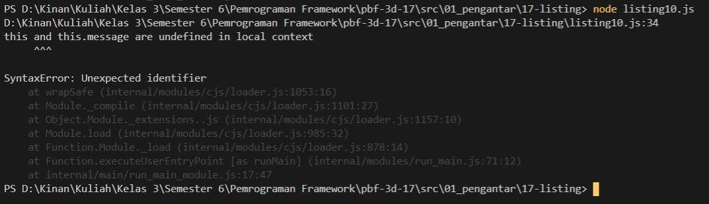

# 01 - Pengantar

## Tujuan Pembelajaran
1. Mahasiswa dapat mengenal pengantar dari javascript

## Hasil Praktikum

1. Source Code

    a. Listing 1
    

    b. Listing 2
    

    c. Listing 3
    

    d. Listing 4
    

    e. Listing 5
    

    f. Listing 6
    

    g. Listing 7
    

    h. Listing 8
    

    i. Listing 9
    

    j. Listing 10
    

    k. Listing 11
    

    l. Listing 12
    

    m. Listing 13
    

    n. Listing 14
    

    o. Listing 15
    

    p. Listing 16

    - amazing.js
    

    - fantastic.js
    

    - index.html
    

    - script.js
    

    - wonderful.js
    

    q. Listing 17

    - amazing.js
    

    - fantastic.js
    

    - index.html
    

    - script.js
    

    - wonderful.js
    

    r. Listing 18
    

    s. Listing 19
    

    t. Listing 20
    

2. Hasil Tampilan

    a. Listing 1
        

    b. Listing 2
        

    c. Listing 3
        

    d. Listing 4

        

    e. Listing 5
        

    f. Listing 6
        

    g. Listing 7
        

    h. Listing 8
        

    i. Listing 9
        

    j. Listing 10
        

    k. Listing 11
        

    l. Listing 12
        

    m. Listing 13
        

    n. Listing 14
        

    o. Listing 15
        

    p. Listing 16
        

    q. Listing 17
        

    r. Listing 18
        

    s. Listing 19
        

    t. Listing 20
        