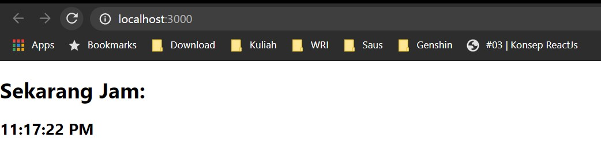
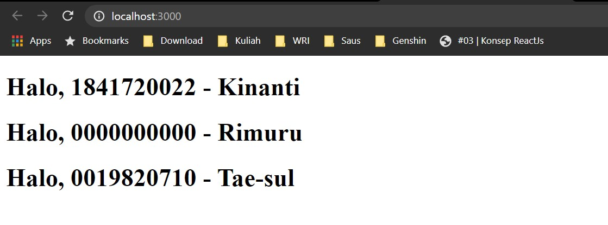

# 02 - Konsep ReactJS

## Tujuan Pembelajaran
1. Mahasiswa dapat mempelajari konsep yang ada di ReactJS

## Hasil Praktikum

1. Source Code

    1. Praktikum 1

        

        coba:

        

    2. Praktikum 2

        

    3. Praktikum 3

        

    4. Praktikum 4

        

        

    5. Praktikum 5

        

    6. Praktikum 6

        

2. Hasil Tampilan

    1. Praktikum 1

        

        coba:

        

    2. Praktikum 2

        

    3. Praktikum 3

        

    4. Praktikum 4

        

    5. Praktikum 5

        

    6. Praktikum 6

        