# 03 - Konsep ReactJS Bagian 2

## Tujuan Pembelajaran
1. Mahasiswa dapat mempelajari konsep yang ada di ReactJS

## Hasil Praktikum

1. Source Code

    1. Praktikum 1

        Cara 1:

        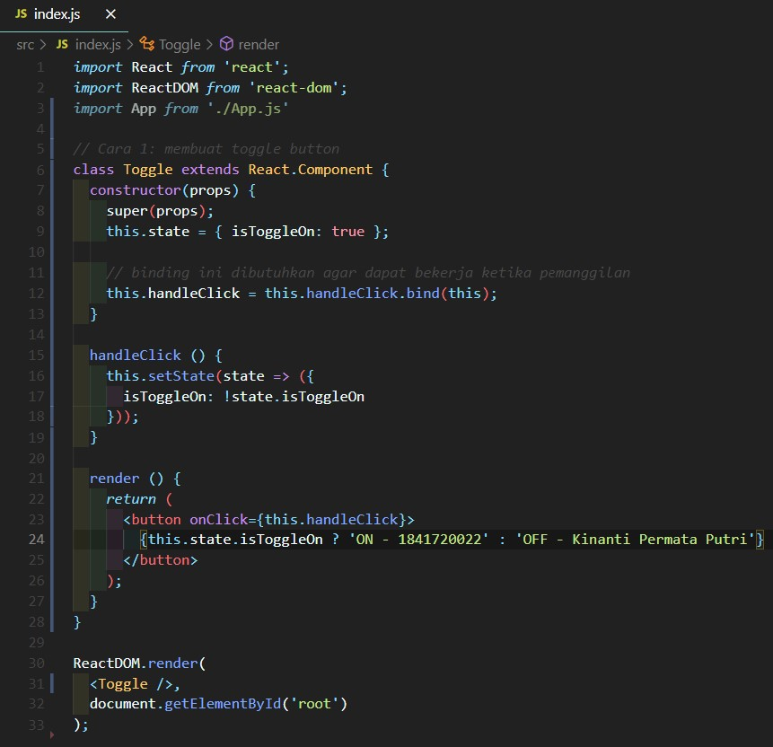

        Cara 2:

        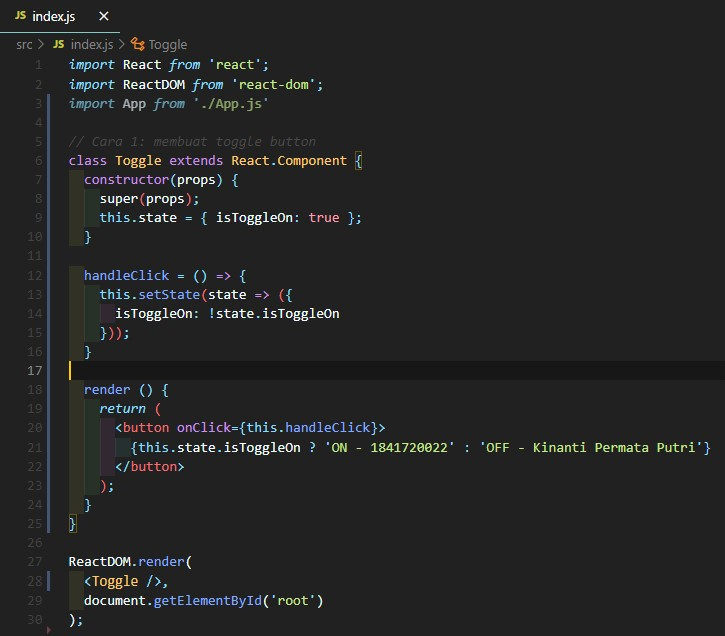

        Cara 3:

        

    2. Praktikum 2

        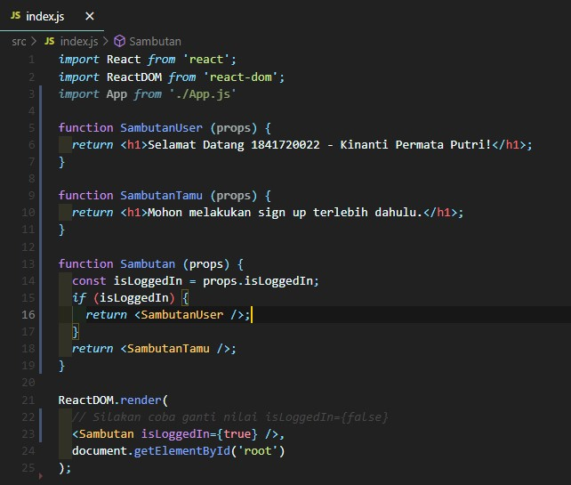

    3. Praktikum 3

        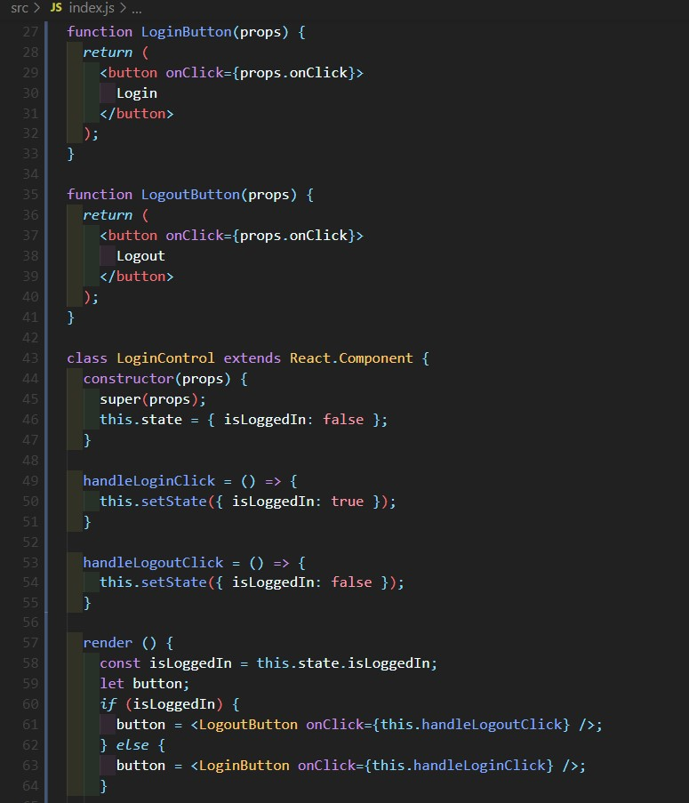

        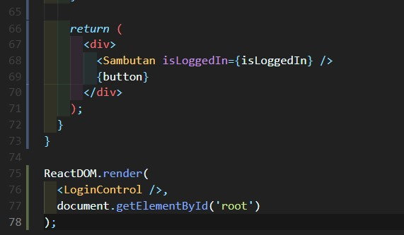

    4. Praktikum 4

        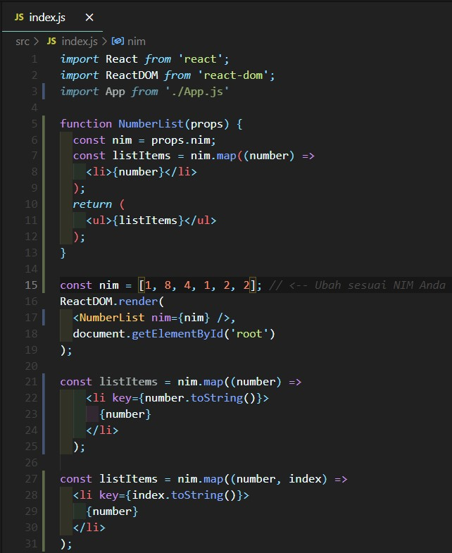

    5. Praktikum 5

        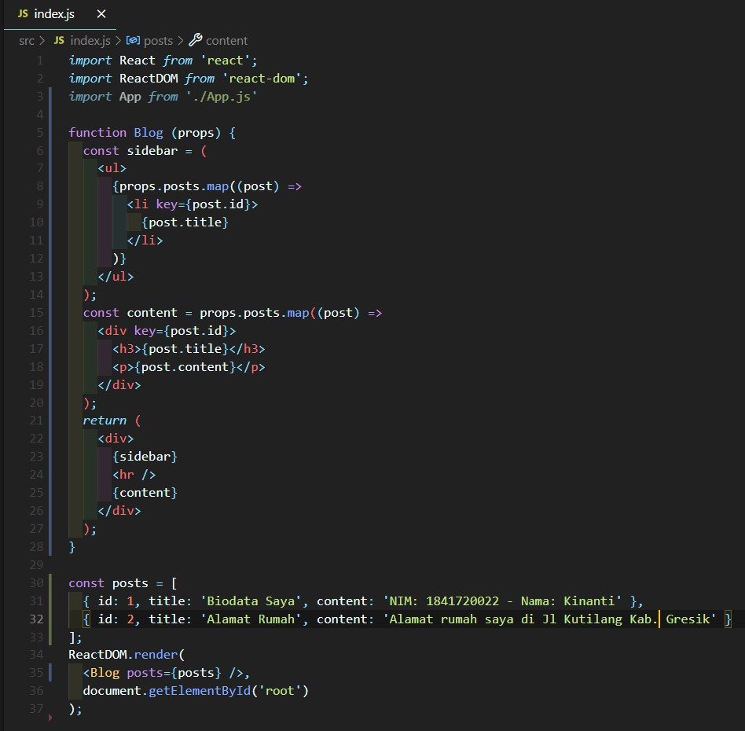

    6. Praktikum 6

        index-form:

        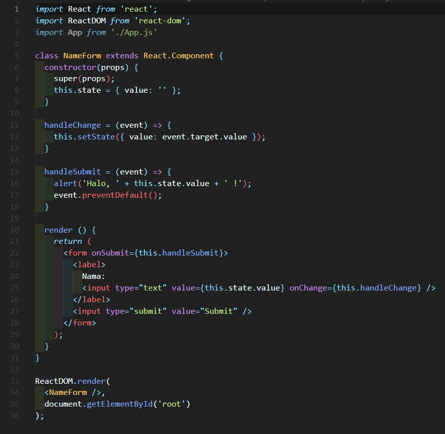

        index-textarea:

        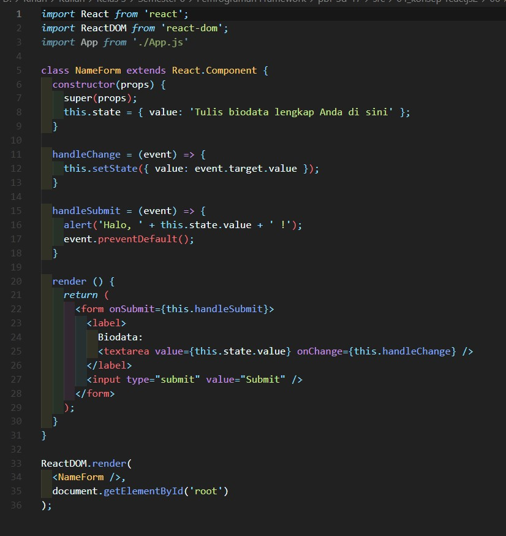

        index-select:

        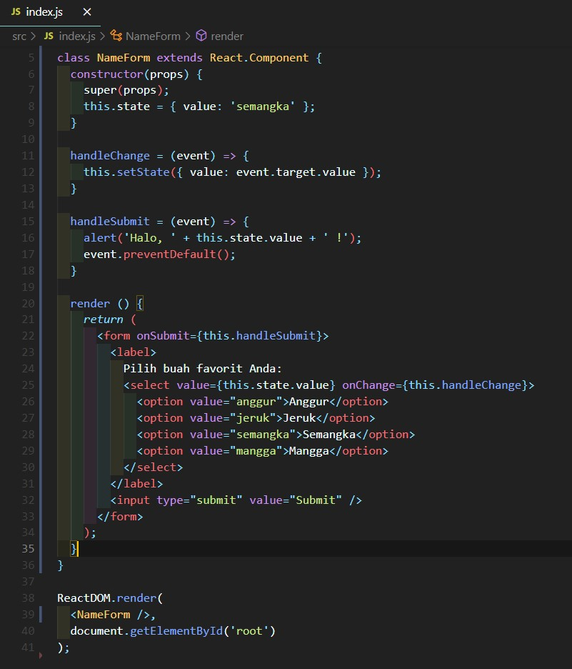

        index-multiple-select:

        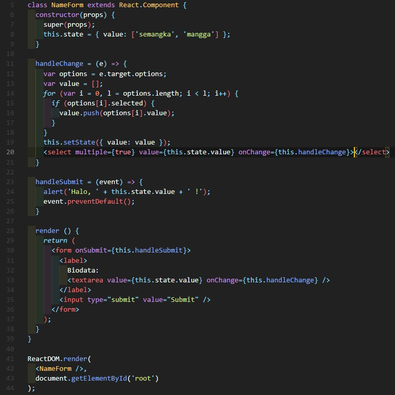

2. Hasil Tampilan

    1. Praktikum 1

        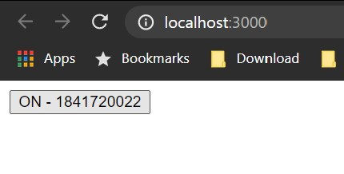

        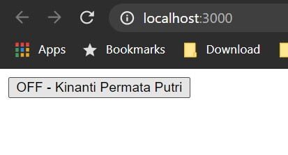

    2. Praktikum 2

        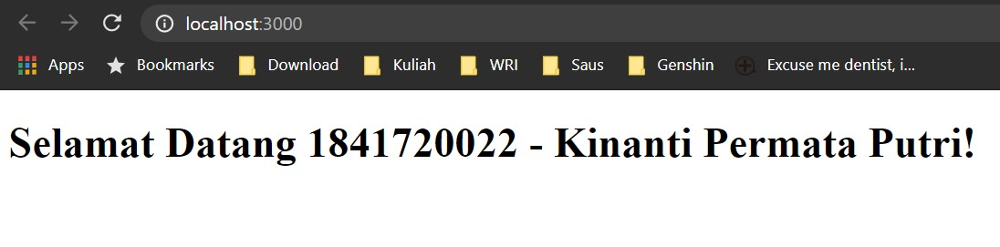

    3. Praktikum 3

        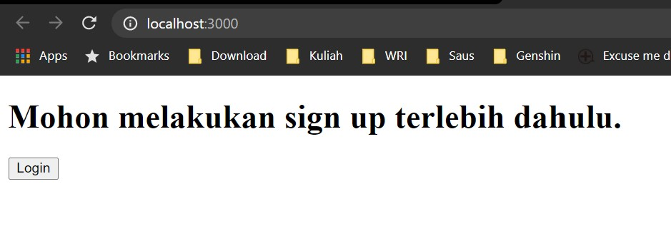

        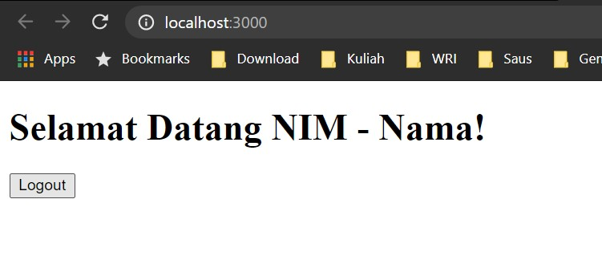

    4. Praktikum 4

        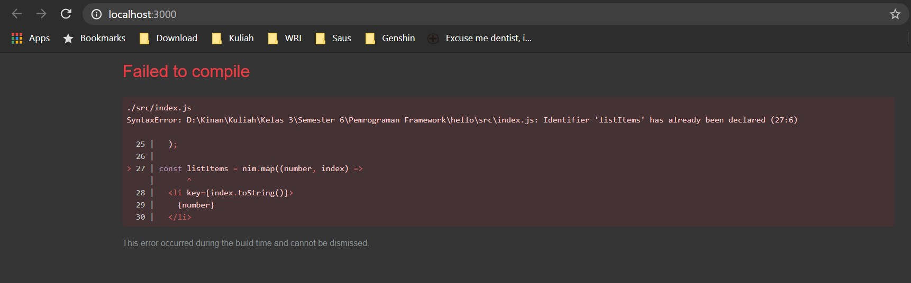

    5. Praktikum 5

        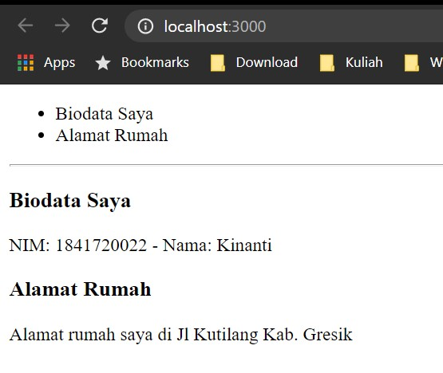

    6. Praktikum 6

        index-form:

        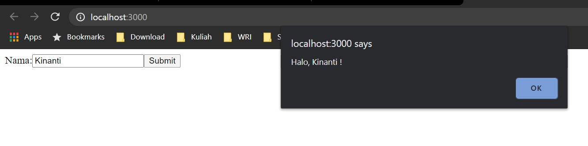

        index-textarea:

        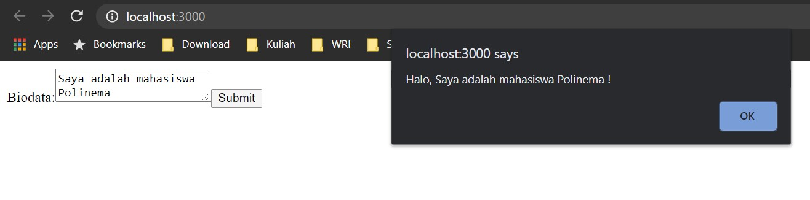

        index-select:

        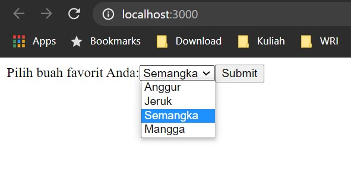

        index-multiple-select:

        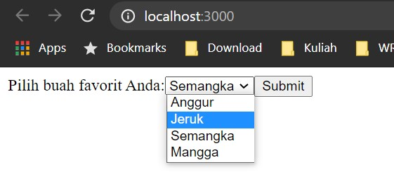
