# 05 - Api Router ReactJS

## Tujuan Pembelajaran
1. Mahasiswa dapat mempelajari routing dan API di ReactJS

## Hasil Praktikum

1. Source Code

    1. Praktikum 1

        

        

    2. Praktikum 2

        - Apps.js

        

        

        - Index.js
        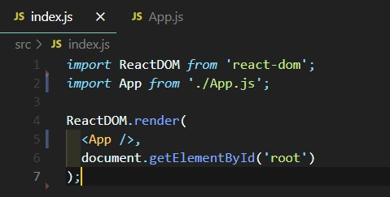

    3. Praktikum 3

        -Apps.js

        

        

        

2. Hasil Tampilan

    1. Praktikum 1

        

    2. Praktikum 2

        

    3. Praktikum 3

        

        

        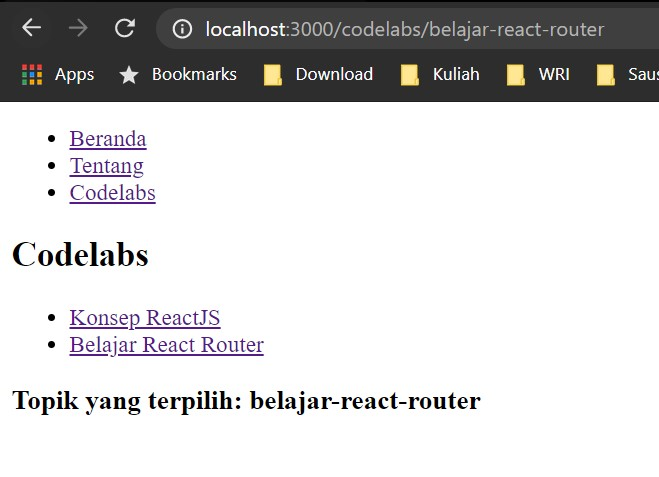

3. Tugas

    1. Source Code

<<<<<<< Updated upstream
    2. Hasil
=======
        - App.js

            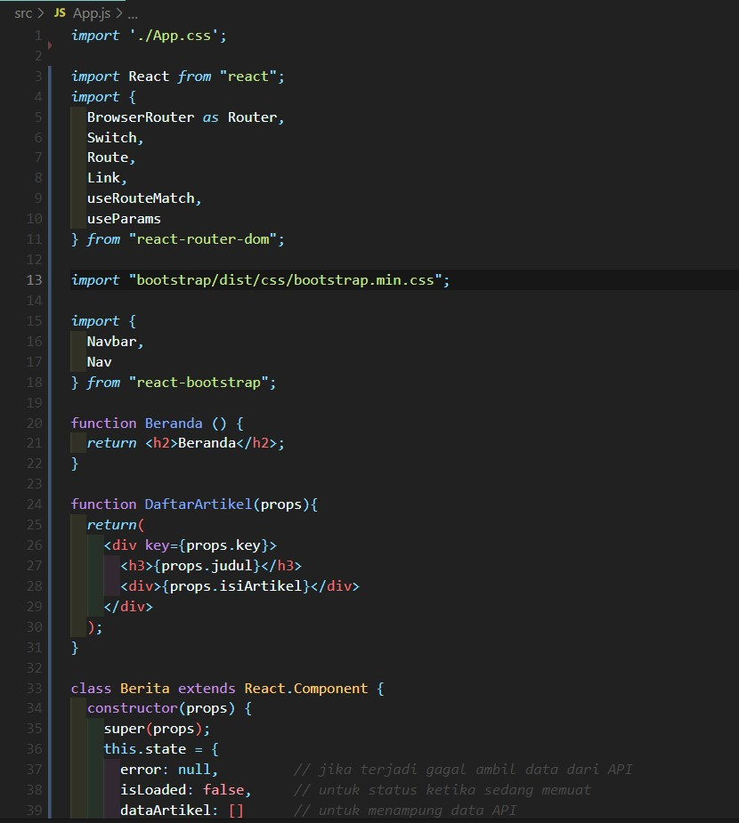

            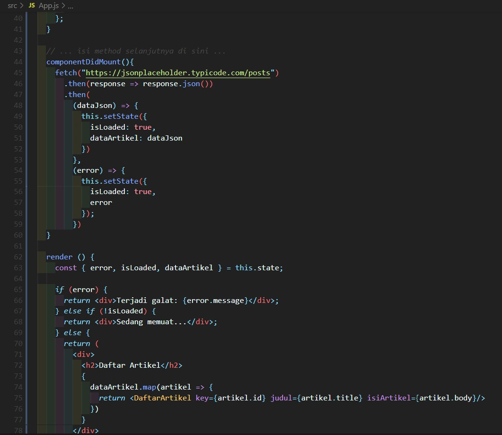

            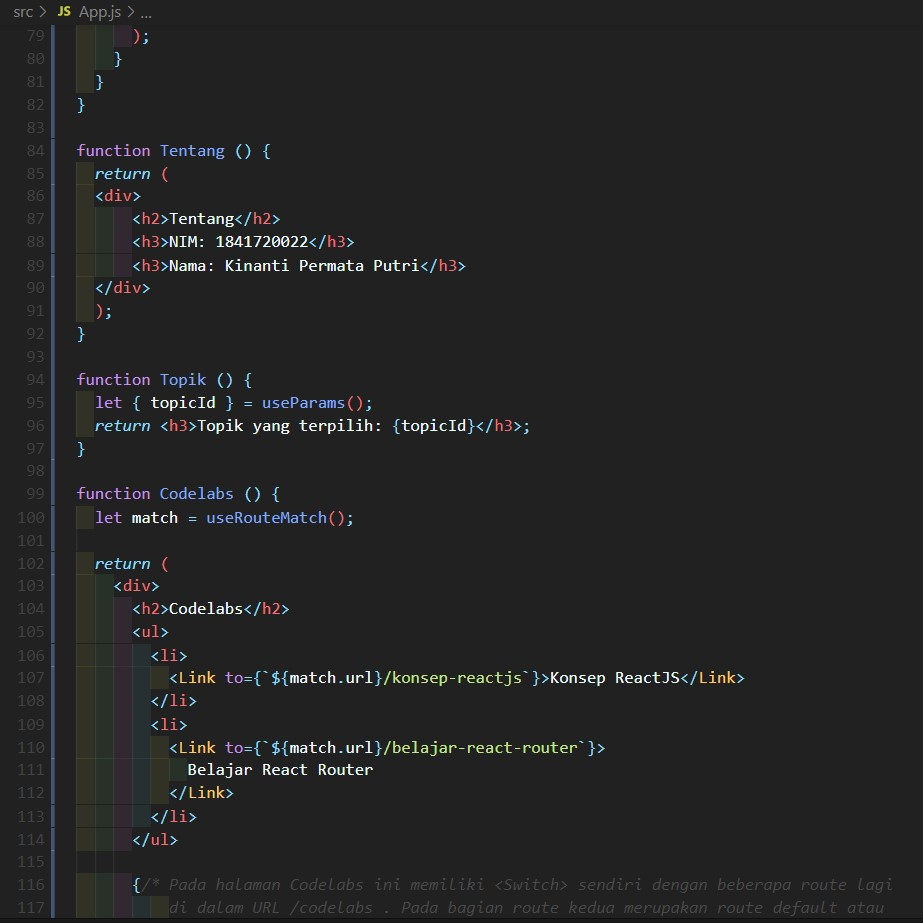

            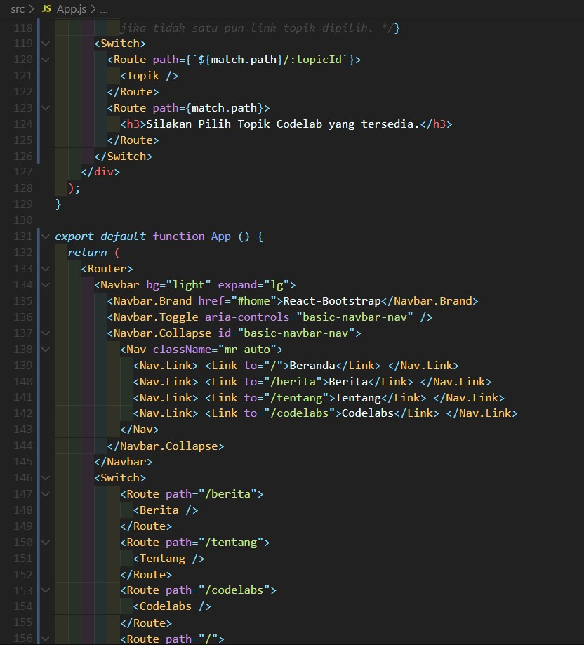

            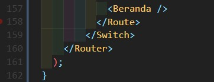

        - index.js

            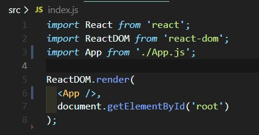

    2. Hasil

        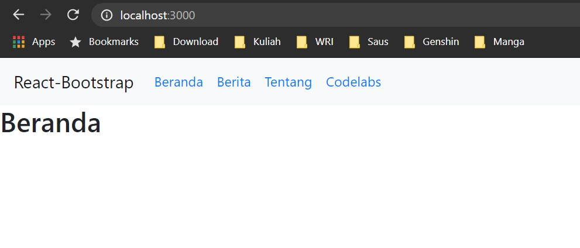

        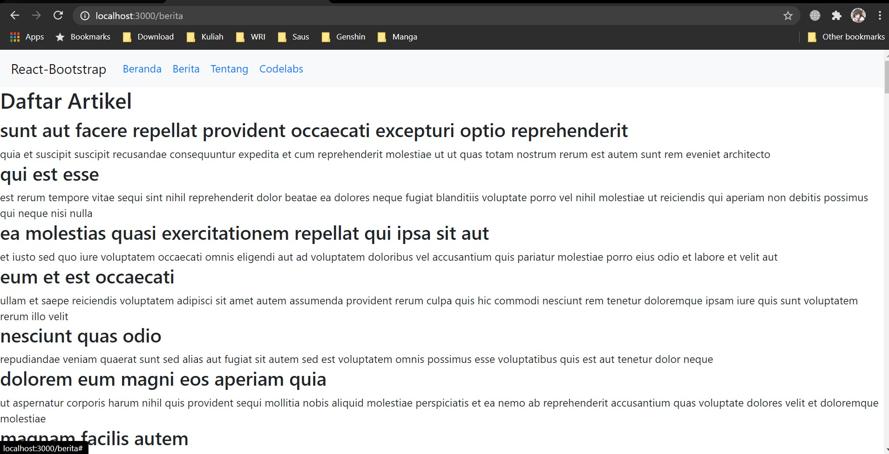

        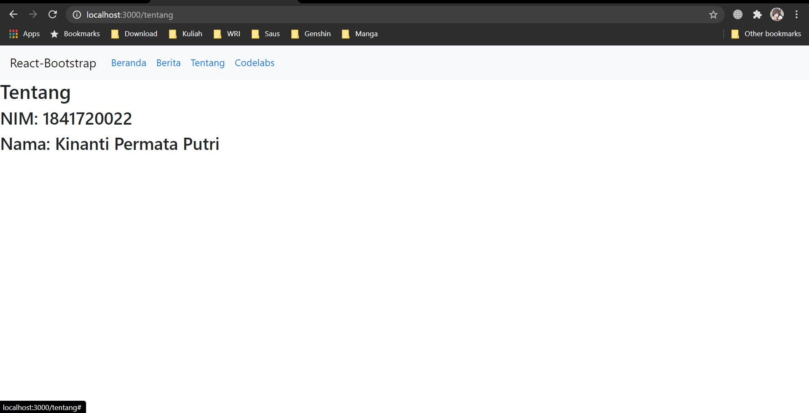

        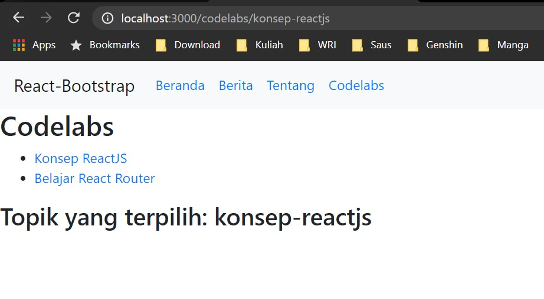
>>>>>>> Stashed changes
