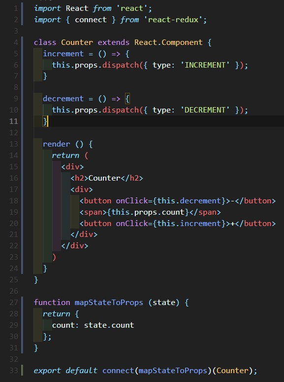
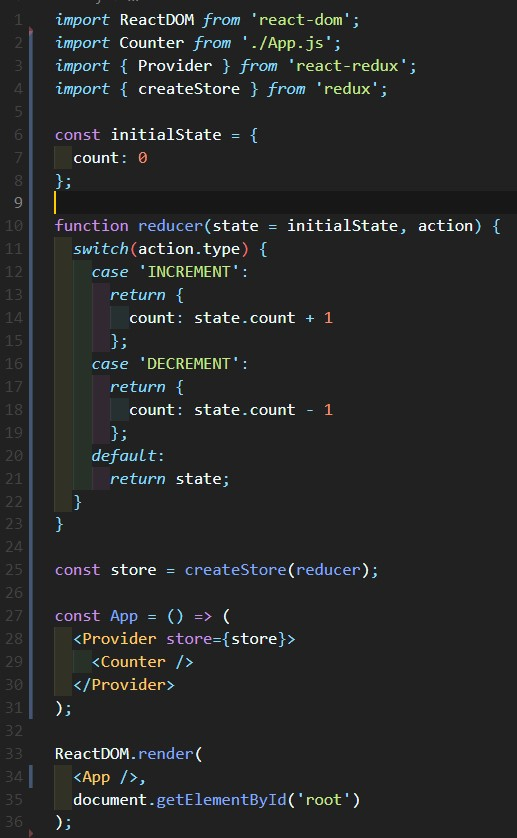
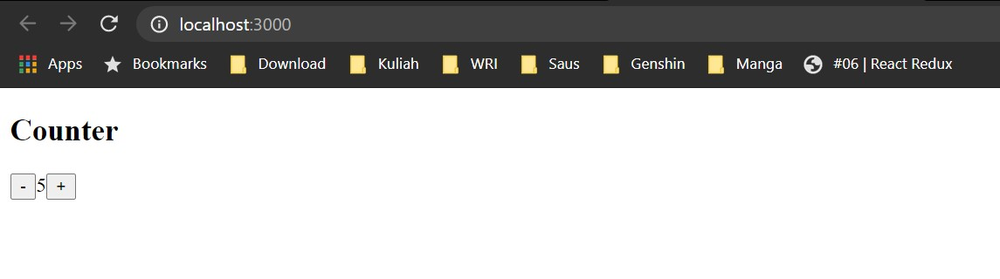
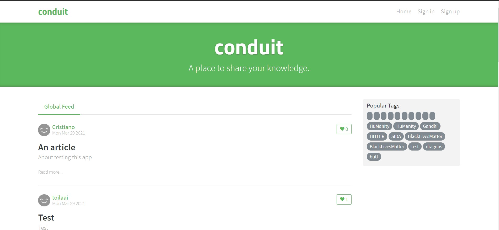
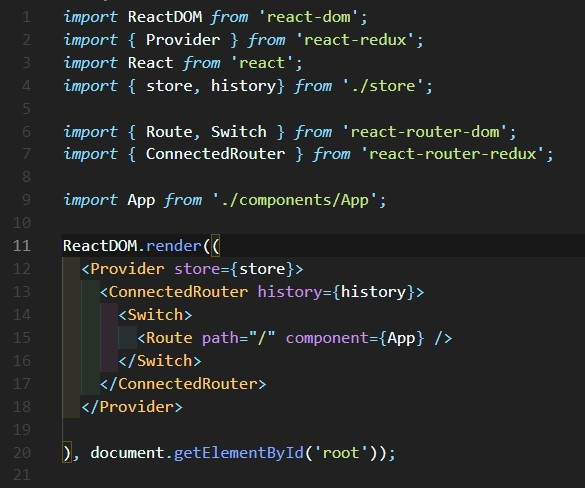
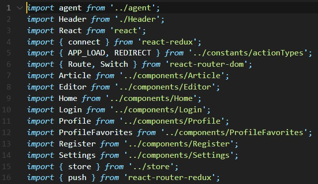
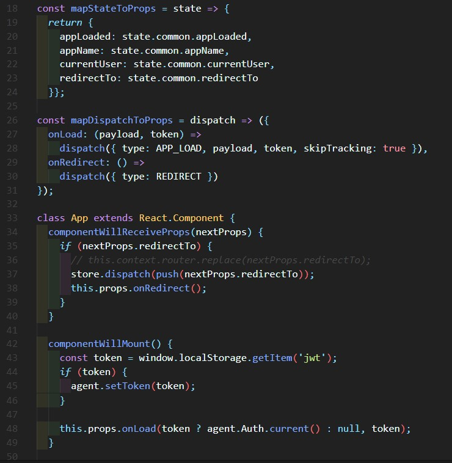
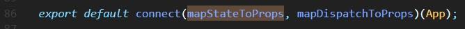
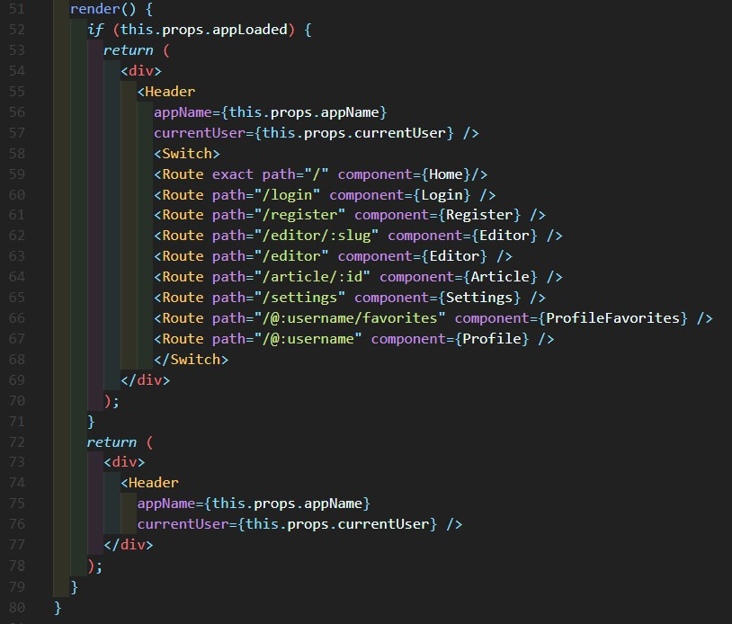

# 06 - React Redux

## Tujuan Pembelajaran
1. Mahasiswa dapat mempelajari cara menggunakan React Redux

## Hasil Praktikum

1. Source Code

    1. Praktikum 1

        

        

2. Hasil Tampilan

    1. Praktikum 1

        

3. Tugas

    1. Jelaskan maksud sintaks this.props.dispatch pada praktikum langkah 16 sebelumnya!
        Jawaban: Sintaks tersebut untuk mendispatch perintah increment/decrement
        agar angka bisa diatur bertambah dan berkurang.

    2. Jelaskan maksud istilah yang ada dalam Redux berikut ini:
        Actions: Yaitu, sebuah objek javascript "{}" yang memberitahu reducer agar bisa
        memodifikasi data dan harus memiliki atribut type berupa string

        Reducers: Yaitu,function yang memilki return data

        Action creators: Yaitu, function untuk mereturn suatu tindakan. Redux menyertakan fungsi utilitas
        yang disebut bindActionCreators untuk mengikat satu atau lebih pembuat tindakan ke fungsi dispatch()

        Middleware: Untuk memberikan titik ekstensi pihak ketiga antara pengiriman tindakan, dan saat tindakan tersebut mencapai reducer.
        Orang-orang menggunakan middleware Redux untuk pencatatan, pelaporan kerusakan, berbicara dengan API asinkron, routing, dll.
        (https://redux.js.org/tutorials/fundamentals/part-4-store#:~:text=Redux%20middleware%20provides%20a%20third,API%2C%20routing%2C%20and%20more.)

        Pure functions: Sebuah fungsi mengembalikan hasil yang sama untuk argumen yang sama. (https://www.tutorialspoint.com/redux/redux_pure_functions)

        Immutability: Yaitu, bahwa sesuatu tidak dapat mengubah nilai atau statusnya. (https://blog.logrocket.com/immutability-in-react-ebe55253a1cc/)

    3. Jelaskan maksud sintaks export default connect(mapStateToProps)(Counter) pada praktikum langkah 9 sebelumnya!
        Jawaban: Yaitu, untuk mengekspor class App dengan menggunakan koneksi.

    4. Carilah sebuah studi kasus aplikasi yang cukup kompleks di GitHub yang memanfaatkan Redux! Kemudian screenshot bagian kode program mana yang merupakan proses Redux dan jelaskan prosesnya! (cantumkan link repository GitHub yang Anda temukan)

    Berikut adalah tampilan dari salah satu contoh react redux

    

    Di index.js kita akan mengimpor library react dan menghubungkan nya ke App.js yang berada di komponen

    

    Di App.js kita juga akan menambahkan import component yang akan digunakan untuk website

    

    Disini kita akan membuat mapStateToProps untuk membuat fungsi react redux dan akan di connect kan dari app ke index

    

    

    Setelah itu kita bisa mengatur controller halaman website tersebut

    
    
    Link Github Kasus: https://github.com/gothinkster/react-redux-realworld-example-app
