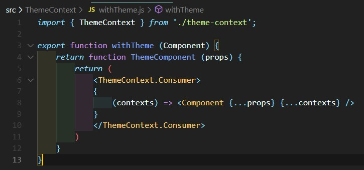
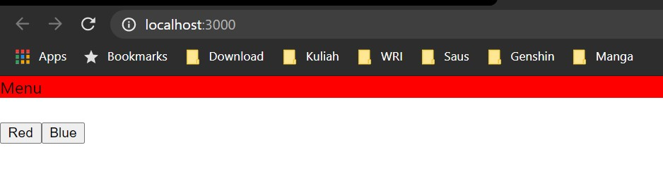

# 06 - Context HOC

## Tujuan Pembelajaran
1. Mahasiswa dapat mempelajari cara penggunaan Context dan Higher-Order Components (HOC) di ReactJS

## Hasil Praktikum

1. Source Code

    1. Praktikum 1

        

        

        

        

        

        

2. Hasil Tampilan

    1. Praktikum 1

        

        