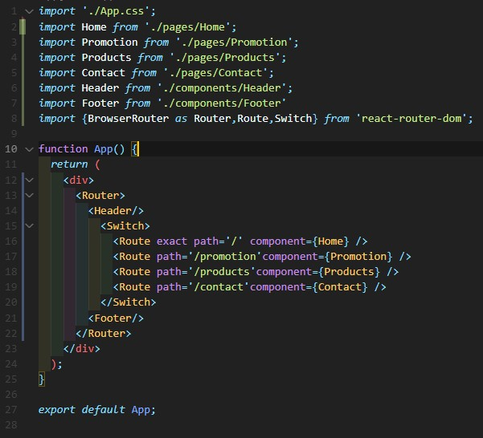
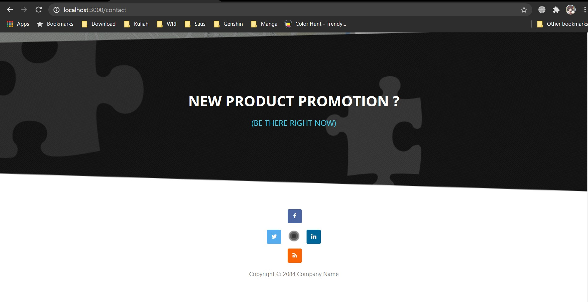

# 08 - UTS

## Hasil Praktikum

1. Source Code

    1. Home.js

        

        

        

        

    2. Promotion.js

        

        

    3. Products.js

        

        

        

        

    4. Contact.js

        

        

    5. Header.js

        

    6. Footer.js

        

    7. index.html

        

        

    8. App.js

        

2. Hasil Tampilan

    1. Home.js

        

        

        

    2. Promotion.js

        

        

        

    3. Products.js

        

        

    4. Contact.js

        

        