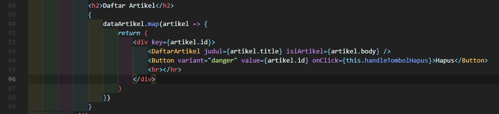

# 09 - Global API dan Hooks

## Tujuan Pembelajaran
1. Mahasiswa dapat mempelajari tentang global Api dan hooks

## Hasil Praktikum

1. Source Code

    1. Praktikum 1 bagian 1

        a. src/services/index.js

        

        b. src/components/BlogPost.js

        

        c. src/App.js

        

        d. src/index.js

        

    2. Praktikum 1 bagian 2

        a. listArtikel.json

        

    3. Praktikum 1 bagian 3

        a. src/services/index.js

        

        b. src/components/BlogPost.js

        

        

    4. Praktikum 1 bagian 4

        a. src/services/index.js

        

        b. src/components/BlogPost.js

        

        

    5. Praktikum 1 Bagian 5

        a. src/services/API/Config.js

        

        b. src/services/API/Get.js

        

        c. Post.js

        

        d. Delete.js

        

        e. src/services/Artikel/index.js

        

        f. BlogPost.js import

        

2. Hasil Tampilan

    1. Praktikum 1 bagian 1

        

        Jawaban: Hasilnya tidak ada isinya karena belum dimasukkan source API nya.

    2. Praktikum 1 bagian 2

        

        

    3. Praktikum 1 bagian 3

        

        

        

    4. Praktikum 1 bagian 4

        

        

        

    5. Praktikum 1 Bagian 5

        

        

        

3. Tugas