# 10 - Firebase React JS

## Tujuan Pembelajaran
1. Mahasiswa dapat mempelajari membuat register, login, logout terhubung dengan database Google Firebase

## Hasil Praktikum

1. Source Code

    1. Praktikum 1

        a. src/components/Register.js

        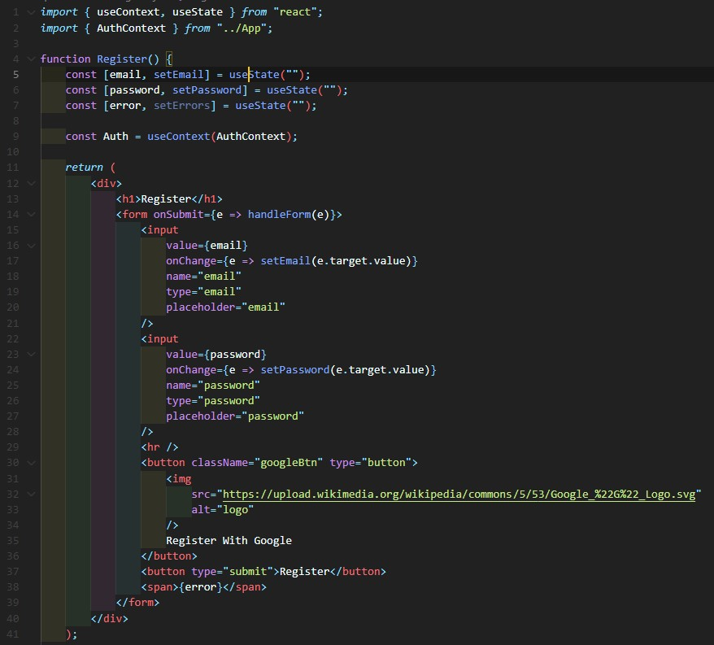

        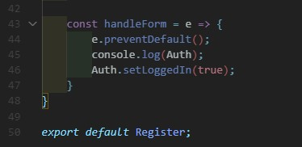

        b. src/components/Header.js

        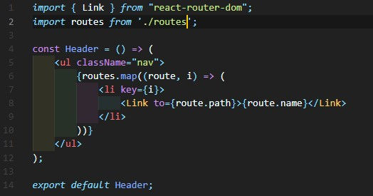

        c. src/App.js

        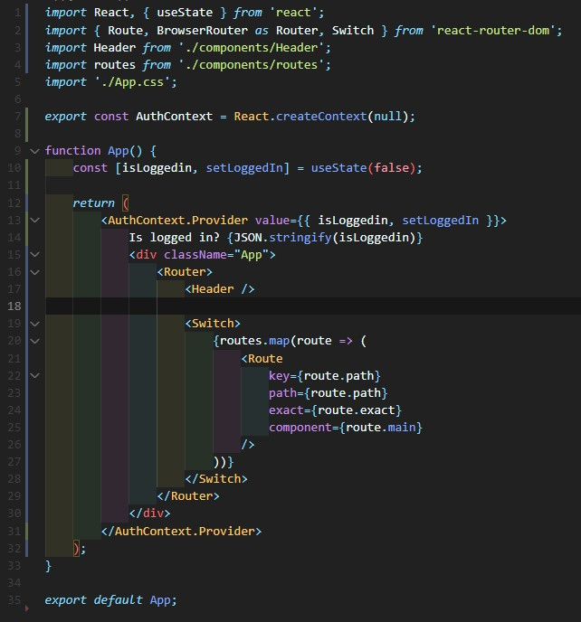

        d. src/components/routes.js

        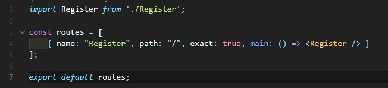

    2. Praktikum 2

        a. src/components/Login.js

        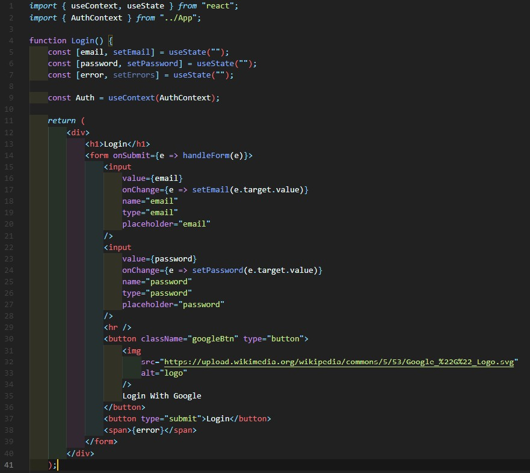

        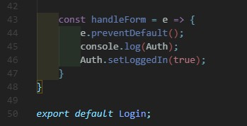

        b. src/components/routes.js

        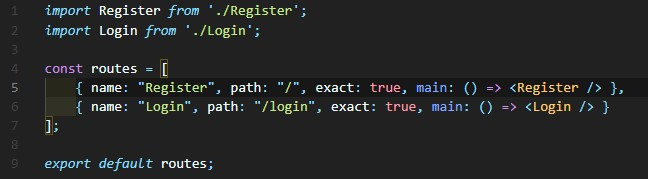

    3. Praktikum 3

        a. firebase.config.js

        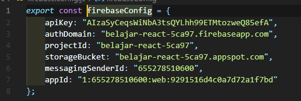

        b. src/components/Register.js

        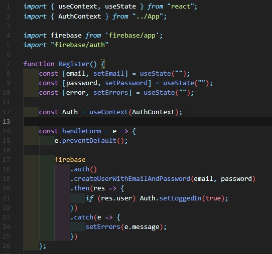

        c. src/components/Login.js

        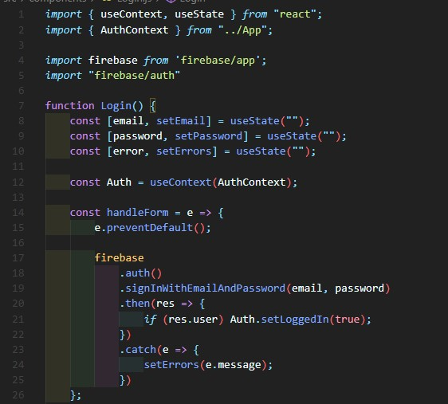

2. Hasil Tampilan

    1. Praktikum 1

        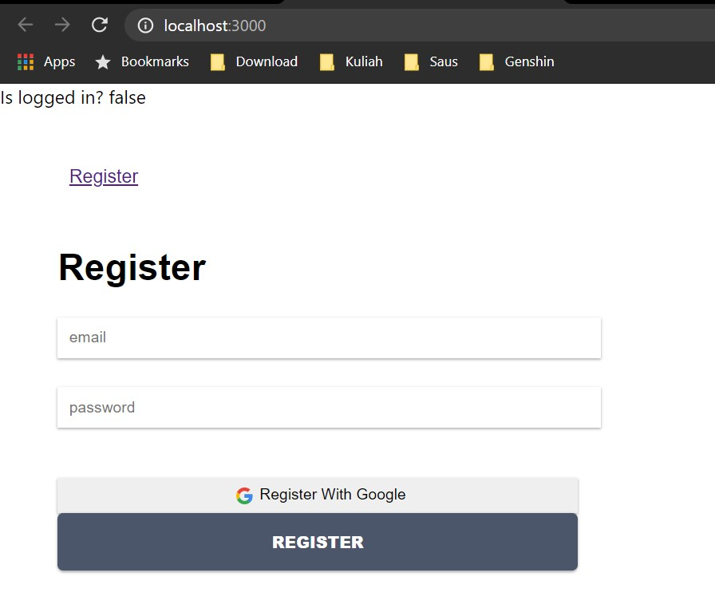

    2. Praktikum 2

        

    3. Praktikum 3

        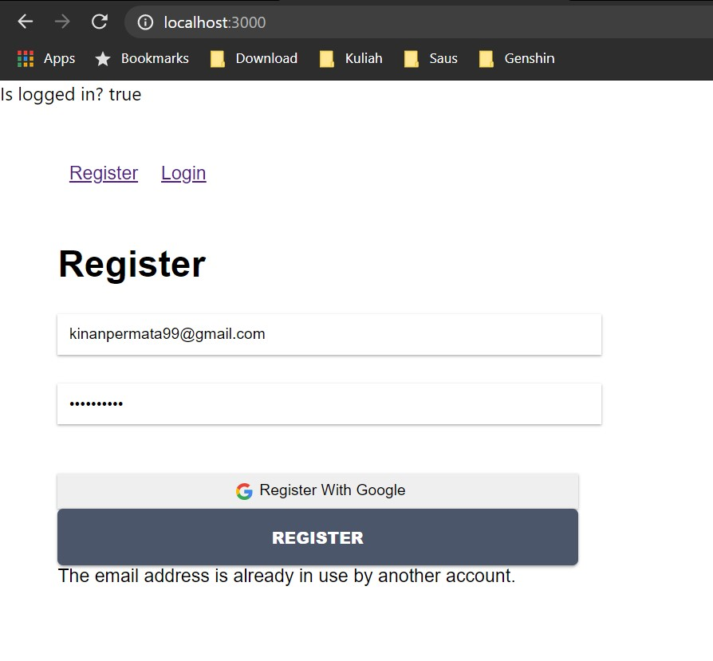

        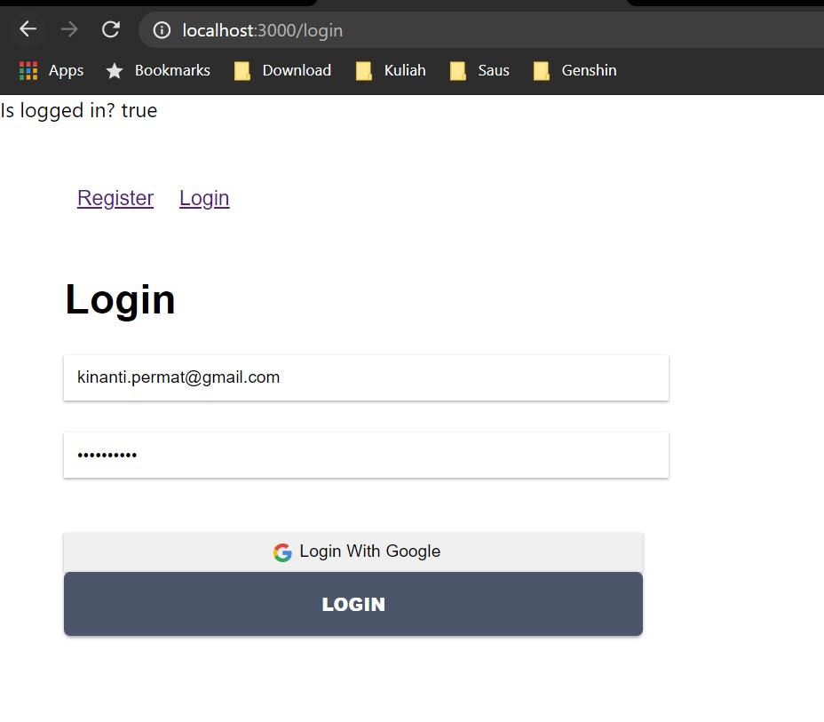

3. Tugas

    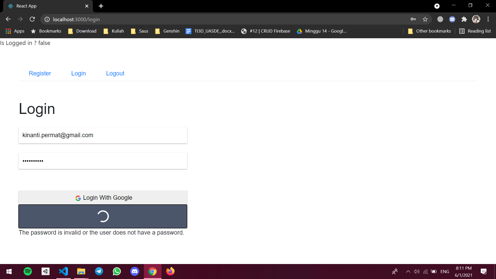

    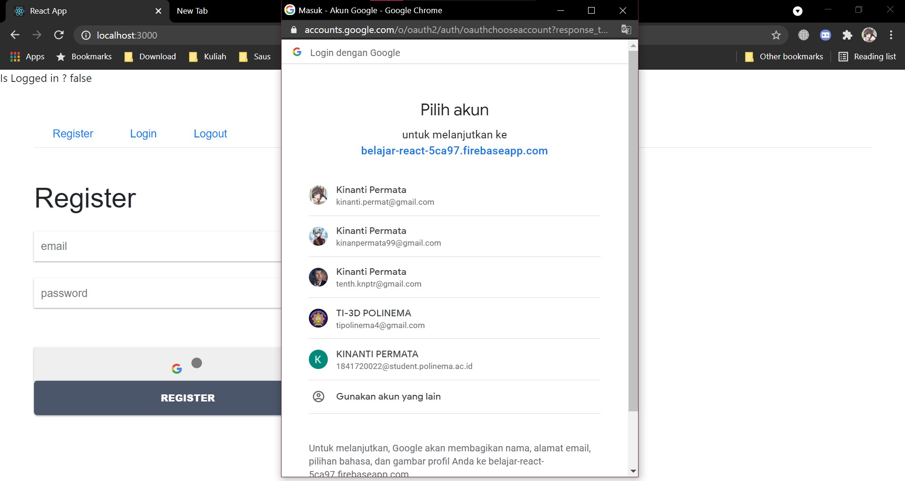

    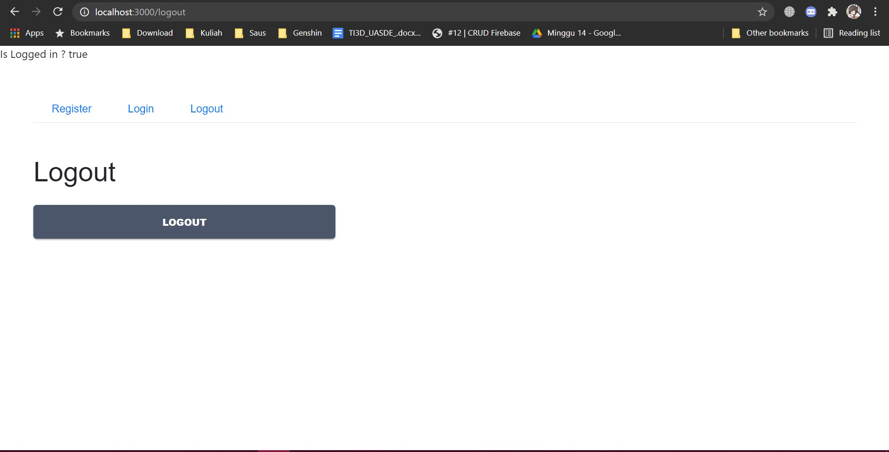