# 11 - Redux Thunk

## Tujuan Pembelajaran
1. Mahasiswa dapat mempelajari membuat login dengan Thunk

## Hasil Praktikum

1. Source Code

    1. Praktikum 1

        a. firebase.config.js

        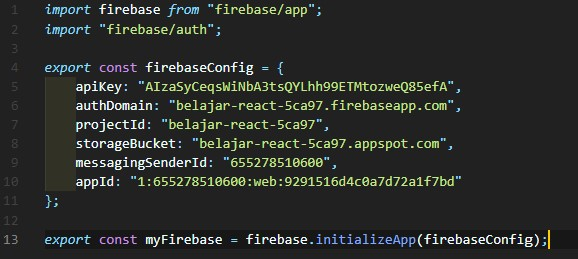

        b. src/redux/actions/auth.js

        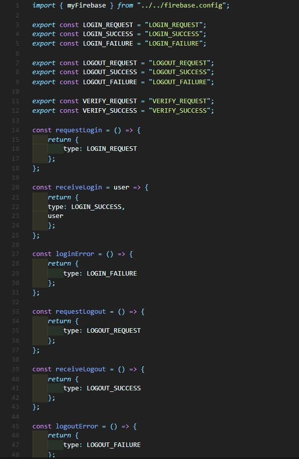

        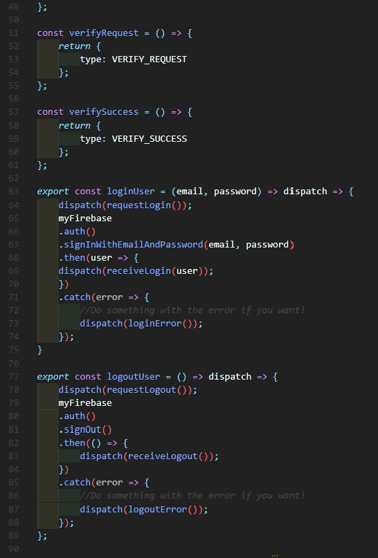

        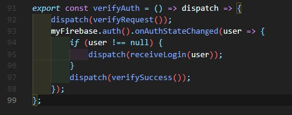

        c. src/redux/reducers/auth.js

        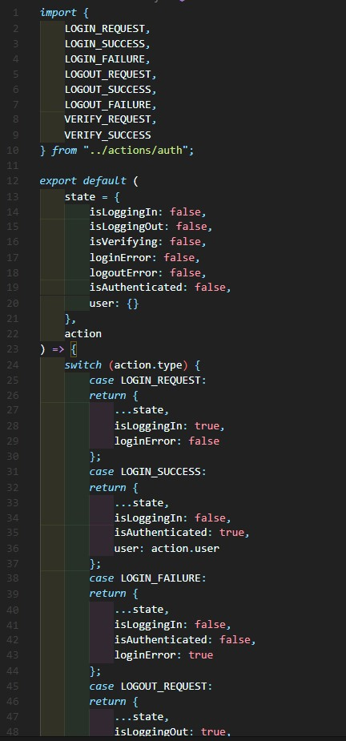

        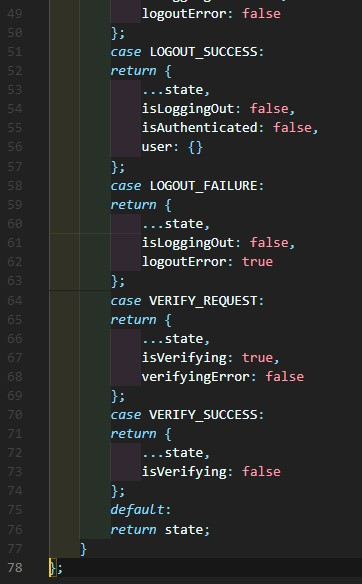

        d. src/redux/index.js

        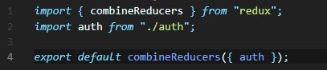

        e. src/redux/configureStore.js

        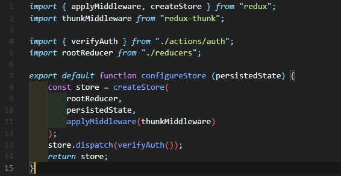

        f. src/components/Login.js

        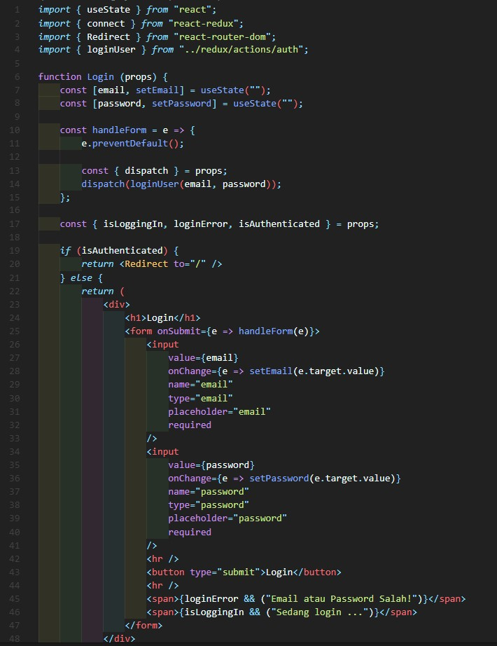

        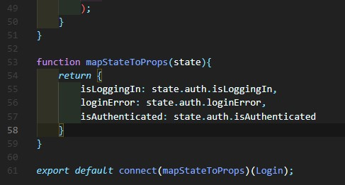

        g. src/components/Home.js

        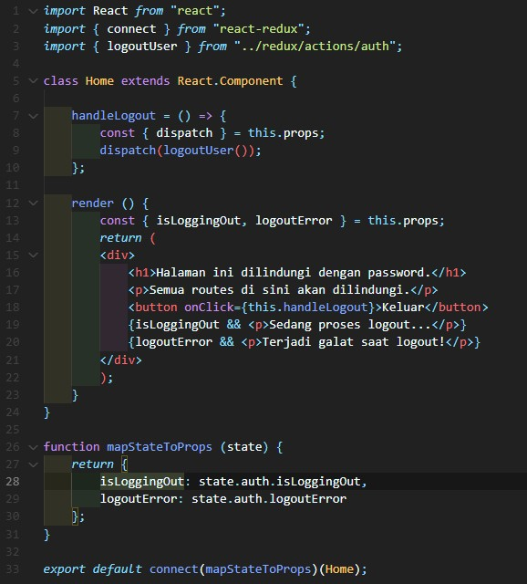

        h. src/routes/protectedRoute.js

        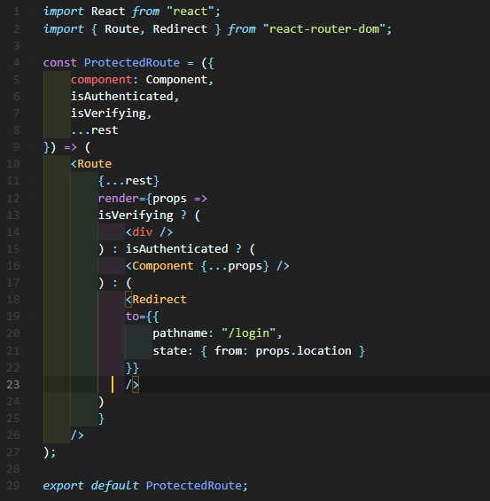

        i. src/Root.js

        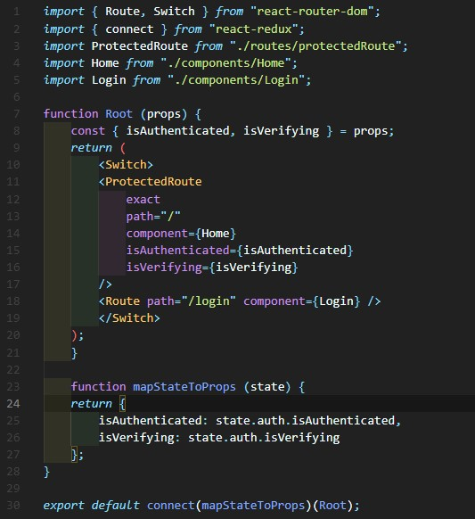

        j. src/App.js

        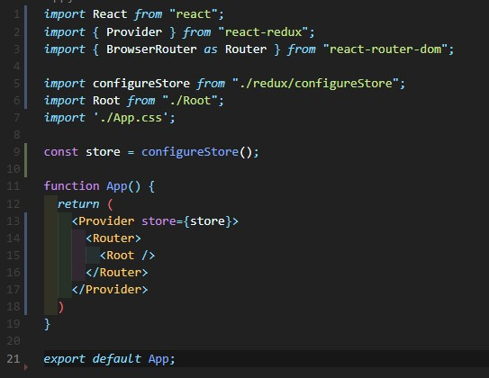

2. Hasil Tampilan

    1. Praktikum 1

        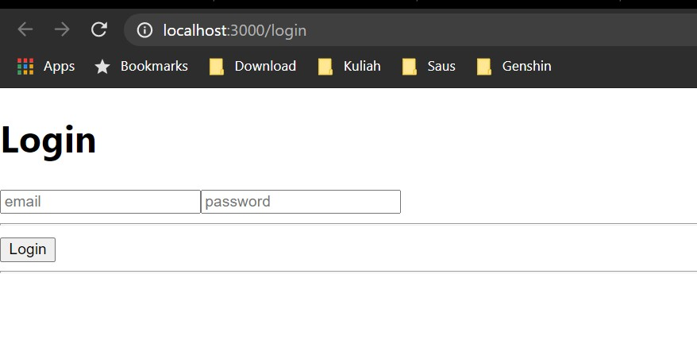

        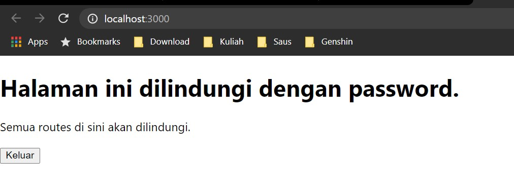

3. Tugas

    1. Berdasarkan praktikum yang telah Anda lakukan, jelaskan perbedaan fitur yang ada dalam komponen Login dan Home! Mengapa komponen Login tidak menggunakan class seperti pada komponen Home?

    Jawaban:
    a. Perbedaan pada fitur Home dan Login adalah di halaman login memiliki fitur login dengan menggunakan email dan password sedangkan di halaman home memiliki tampilan halaman yang terproteksi.

    Gambar:

    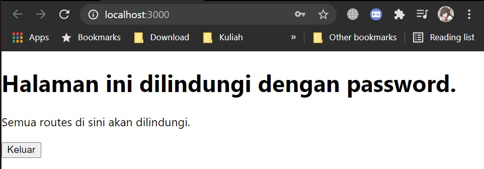

    b. Mengapa Login tidak menggunakan class seperti Home karena fungsi halaman nya berbeda.

    2. Jelaskan kegunaan dan alur logika dari protectedRoute.js!

    Jawaban: Kegunaan nya untuk memproteksi route ketika dari Login ke Home.

    3. Coba lakukan login dengan email atau password yang salah, apa yang terjadi? Jelaskan!

    Jawaban: Ketika kita menekan tombol login dengan email/password yang salah akan muncul pemberitahuan sedang loading kemudian ketika dikonfirmasi salah maka akan muncul pemberitahuan jika email/password salah.

    Gambar:
    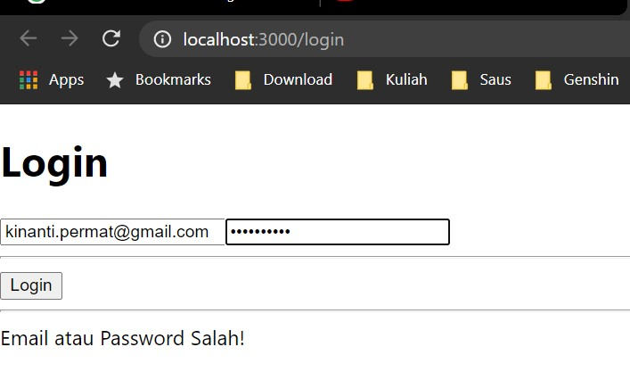

    4. Jika Anda berada di halaman Home, coba akses form login tanpa melakukan logout. Apakah form login bisa diakses? Jelaskan!

    Jawaban:

    5. Tambahkan menu Register pada form login sehingga user yang belum terdaftar dapat melakukan registrasi! Jika registrasi sukses, maka user langsung diarahkan ke halaman Home.

    Jawaban: