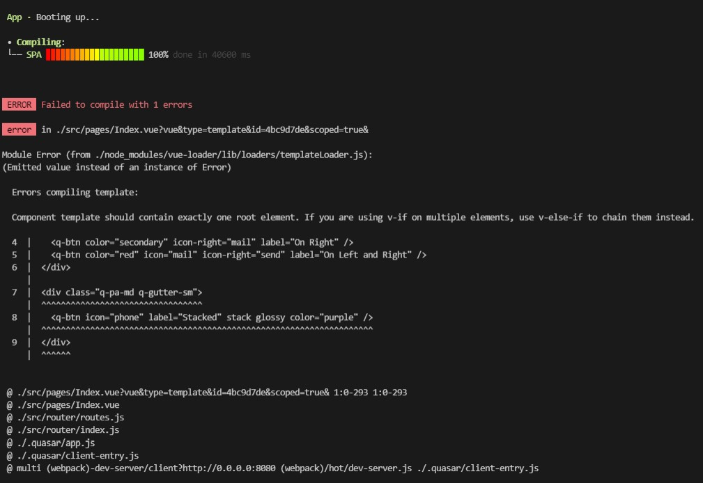

# 14 - Quasar Directives dan Components

## Tujuan Pembelajaran
1. Mahasiswa dapat mempelajari directives dan compenents dari Quasar

## Hasil Praktikum

1. Source Code

    1. Praktikum 1

        a. quasar.conf.js

        

        b. Index.vue

        

        

        

    2. Praktikum 2

        a. quasar.conf.js

        

        b. Index.vue

        

2. Hasil Tampilan

    1. Praktikum 1

      

   2. Praktikum 2

      

3. Tugas

   1. Berdasarkan praktikum 1 yang telah Anda lakukan, jelaskan maksud kode di template: class="q-pa-md row justify-center" ?
      Jawaban: Digunakan untuk membuat sebuah grid row yang diletakkan di posisi tengah.
      Sumber: https://quasar.dev/layout/grid/row

   2. Berdasarkan praktikum 1 pada langkah nomor 4, jelaskan maksud script tersebut seperti kegunaan konstanta colors, fungsi data(), computed, mounted, dan beforeDestroy() !
      Jawaban:

      - colors: Untuk memberikan warna di quasar. (https://quasar.dev/style/color-palette)

      - data(): Untuk memasukkan inputan data untuk atribut yang digunakan.

      - computed: Untuk secara deklaratif menggambarkan nilai yang bergantung pada nilai lain. Saat Anda mengikat data ke properti yang dihitung di dalam template, Vue tahu kapan harus memperbarui DOM ketika salah satu nilai yang bergantung pada properti yang dihitung telah berubah. (https://012.vuejs.org/guide/computed.html)

      - mounted: Adalah kait siklus hidup yang paling umum digunakan di Vue. Vue memanggil mount() saat komponen Anda ditambahkan ke DOM. Ini paling sering digunakan untuk mengirim permintaan HTTP untuk mengambil data yang kemudian akan dirender oleh komponen. (https://masteringjs.io/tutorials/vue/mounted)

      - beforeDestroy(): Kait siklus hidup Vue ini dipanggil tepat sebelum instance Vue dihancurkan, instance dan semua fungsi masih utuh dan berfungsi di sini. Ini adalah tahap di mana Anda dapat melakukan manajemen sumber daya, menghapus variabel dan membersihkan komponen. (https://blog.logrocket.com/introduction-to-vue-lifecycle-hooks/)

   3. Berdasarkan praktikum 2 pada langkah nomor 2, jelaskan maksud tiap kode HTML pada template yang mendefinisikan tiap button tersebut!
      Jawaban: Pertama terdapat tag template untuk membuat sebuah template. Kemudian menmbuat sebuah grid dan button di dalam grid tersebut. Button bisa diatur sesuai warna dan logo yang kita mau.

   4. Coba ganti kode template HTML pada praktikum 2 menjadi seperti berikut. Save file, lalu perhatikan apa yang terjadi ? Mengapa terjadi demikian, jelaskan!
      Jawaban: Hasil nya akan error. Karena kompenen template nya harus ada satu root elemen saja. Jika menggunakan komponen element lebih dari 1 maka harus menggunakan v-else-if.

      